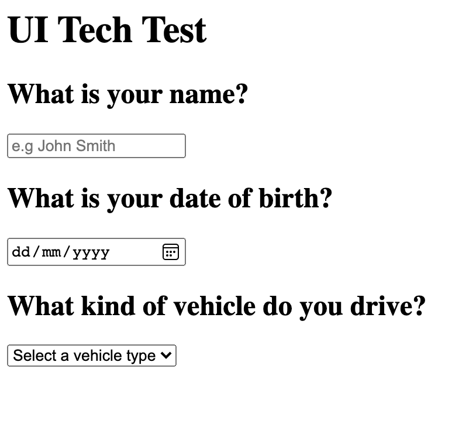

# Tech Test

Description:

I have created a simple form consuming data from a local JSON file, with basic styling and some comprehensive tests. The project uses TypeScript, Jest and CSS. There are comments throughout the code to demonstrate my thinking and choices.

Instructions:

1. **Clone the Repository**

   ```
   git clone https://github.com/cailaar/tech-test.git
   ```

2. **Navigate to the Project Directory and Install Dependencies**

   ```
   npm install
   ```

3. **Build the project**

   ```
   npm run build
   ```

4. **Run the Application**
   ```
   npm start
   ```

---

Consume the JSON file provided at `api.json` and generate a question list UI from the data it describes.

Visually generate something like the image below, using any technology you want. Google is allowed! :)

As a plus add some styling, though not strictly necessary.

## Setup

Use a local web server to point to the files in `/src/`

If you have node installed you should be able to `npm install && npm start` to spin up a local server using the `http-server` module.

## Generate a UI like the following


